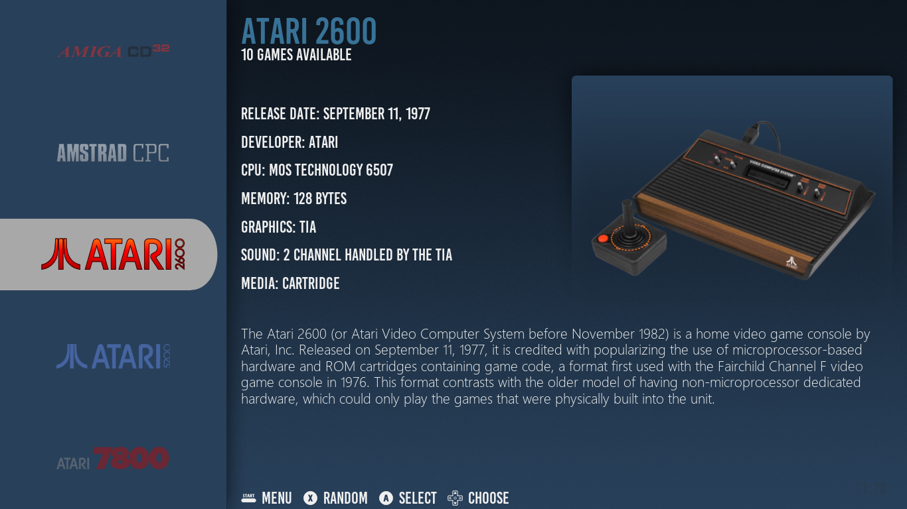
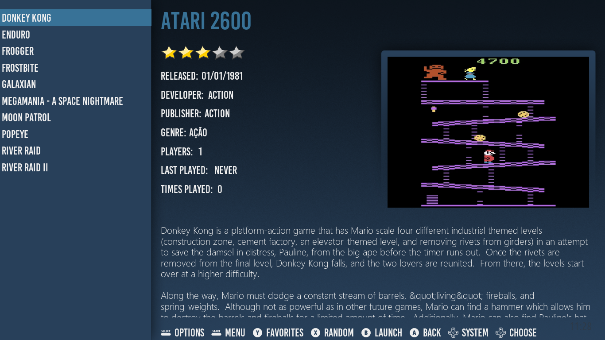
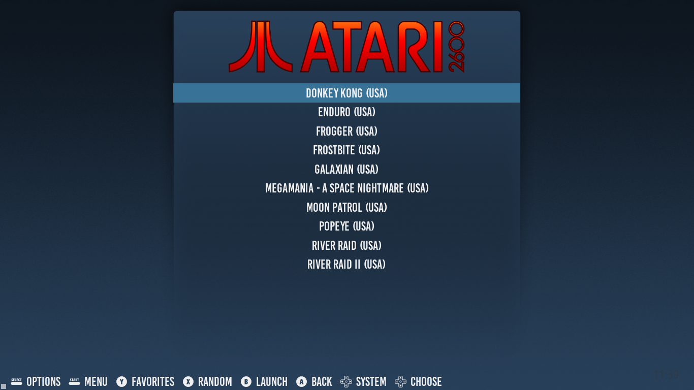

# Fundamental, an EmulationStation theme by Grila
Fundamental is a EmulationStation theme targeted for use on the Raspberry Pi. The design is based on my BigBox theme by the same name (https://forums.launchbox-app.com/files/file/265-fundamental-theme/). This theme supports all the new features of EmulationStation that have been added into the RetroPie build (video snaps, themeable system carousel, etc.).
# Customizing The Colors
To customize the color scheme to your liking, open up colors.xml and change the values for the three theme variables:
* mainThemeColor changes the color of the sidebar, background, and underlay gradients
* titleTextColor changes the color of the title text on the system select screen and the text list highlight
* metaTextColor changes the color of the metadata text and text list text
# Screenshots

